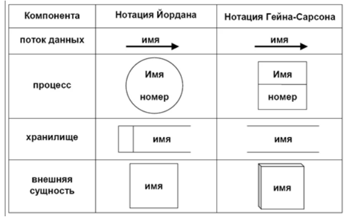
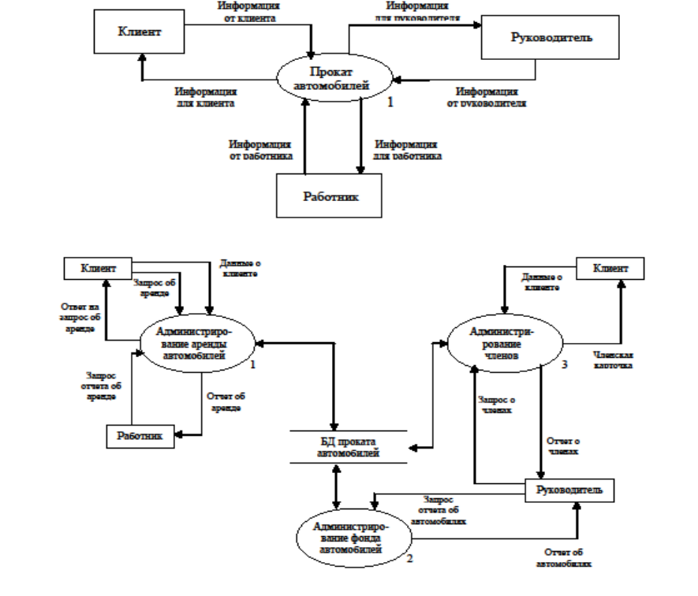
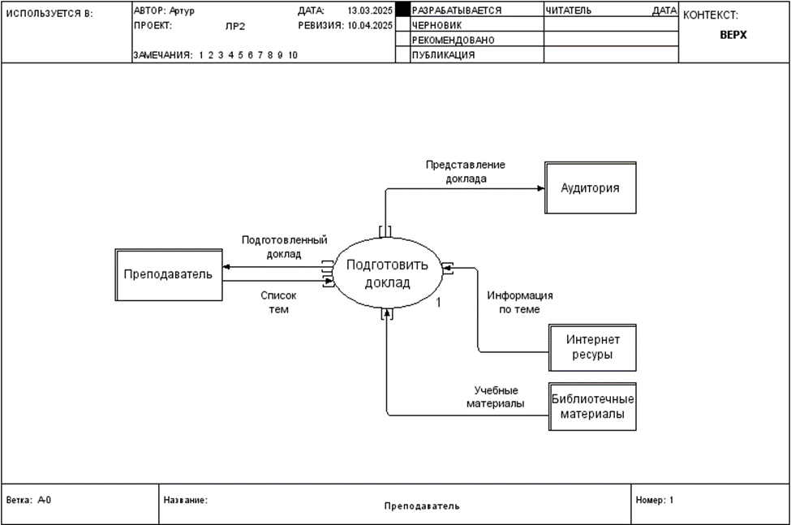
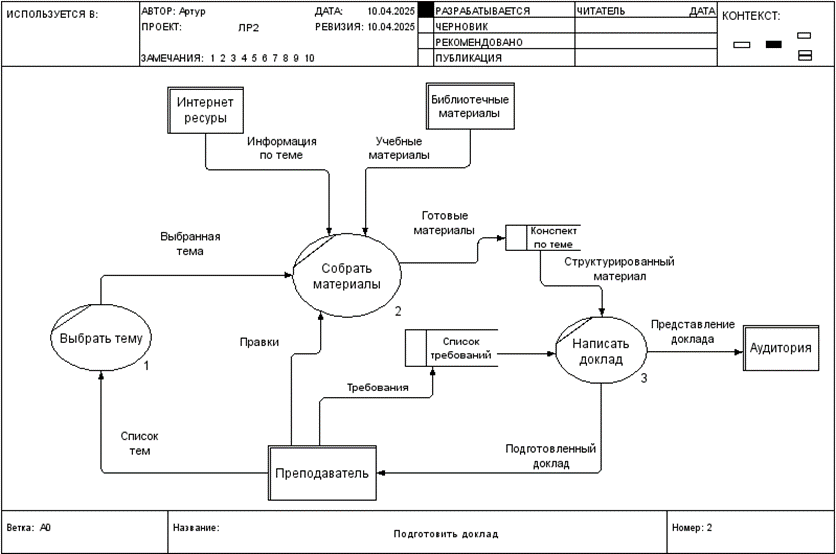
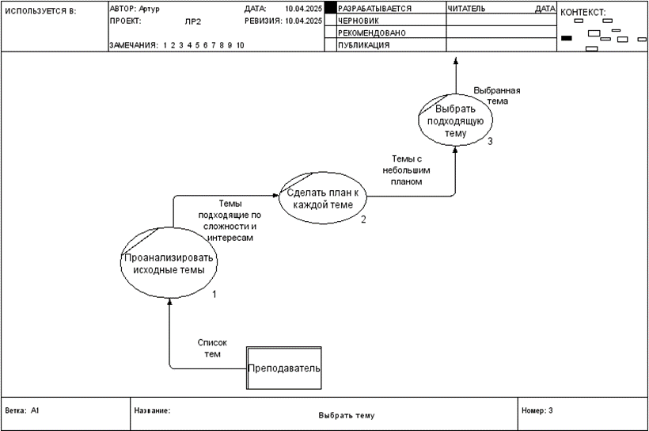
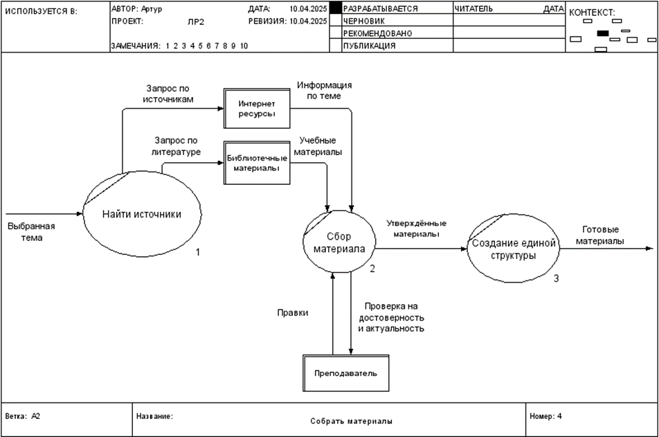
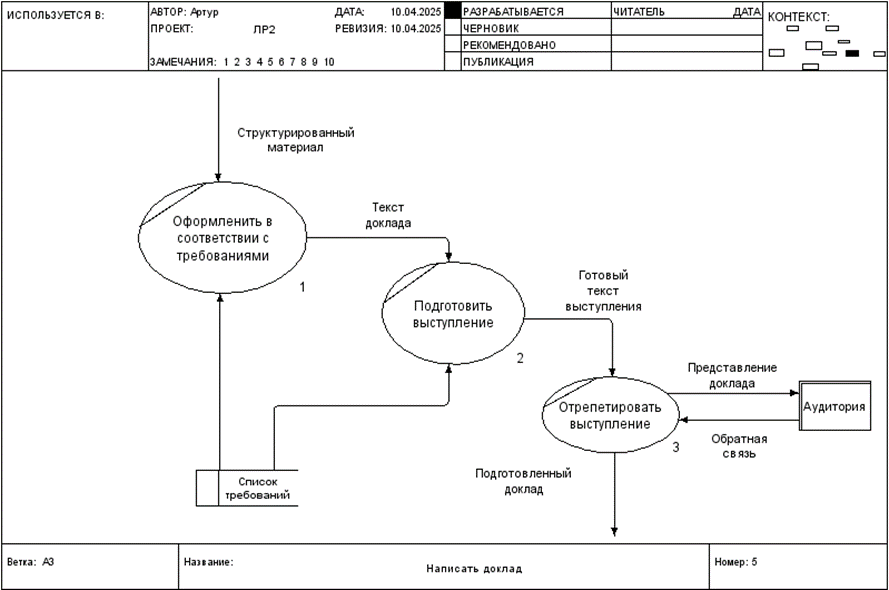

# 7 Билет
## Диаграммы потоков данных

позволяют ==моделировать систему как набор функций== (действий, операций и т.п.), соединенных стрелками. Для метода DFD модель системы — это иерархия диаграмм потоков данных, описывающих ==асинхронный процесс преобразования информации от ее ввода в систему до выдачи пользователю==.
## Элементы DFD в нотациях Гейна-Сарсона и Йордана-Де Марко

- Внешняя сущность — материальный предмет или физическое лицо, представляющее собой ==источник или приемник информации==. Находится за пределами анализируемой части системы (или системы целиком). В процессе анализа некоторые внешние сущности могут переноситься внутрь диаграммы анализируемой системы. Или, наоборот, часть процессов ИС может переноситься за границы моделирования и представляться как внешние сущности. (Например, оплата заказа в интернет-магазине связана с сущностями «пользователь» и «банк»)
- Система и подсистема. При построении модели сложной ИС она может быть представлена в общем виде на так называемой контекстной диаграмме в виде одного блока (т.е. системы), либо декомпозирована на ряд подсистем. Система и подсистема — это ==частный случай процесса==. Наименование системы и подсистемы представляет собой существительное или некоторое предложение с подлежащим.
- Процесс. Под процессом понимается ==преобразование входных потоков данных в выходные в соответствии с определенным алгоритмом==. Физически процесс может реализовываться посредством персонала организации, аппаратуры, программы и т.п. Наименование процесса: активный глагол в неопределенной форме, за которым следует дополнение в виде существительного в винительном падеже («вычислить квадратный корень» и т.п.).
- Накопитель данных — абстрактное ==устройство для хранения информации==. Накопитель данных часто является прообразом будущей БД. Наименование накопителя данных представляет собой существительное.
- Поток данных — ==информация, передаваемая== от источника к приемнику по некоторому каналу (соединению). Потоки могут быть двунаправленными (например БД)

Соединяется всё через процессы
## Порядок построения иерархии.

1. ==Создание контекстной диаграммы==; обычно для простой ИС строится одна диаграмма со звездообразной топологией: центр звезды — система, углы — внешние сущности.
2. ==Детализация системы и процессов==. При этом должно соблюдаться правило балансировки: на диаграмме детализации могут указываться только те источники и приемники информации, которые показаны для детализируемой системы (процесса). Правило нумерации процессов: номер имеет вид типа X.Y, где Y — порядковый номер процесса, детализирующего процесс X.
3. Завершение детализации. Детализация процесса ==не выполняется== в следующих случаях:
	- небольшое число входных и выходных потоков данных (==2-3 потока==); 
	- можно описать процесс преобразования данных последовательным ==алгоритмом==;
	- преобразование входной информации в выходную описывается ==единственной логической функцией==;
	- можно описать логику процесса с помощью так называемой ==мини спецификации== —  текст объемом 20-30 на естественном языке, в котором четко определяется функция преобразования.
4. Верификация (проверка на корректность). Должно выполняться правило ==сохранения информации==: все поступающие данные должны быть считаны, все считываемые — записаны.

# [[Билет 9]]

# 27 Билет

# 30 Билет

# 33 Билет

# Пример

