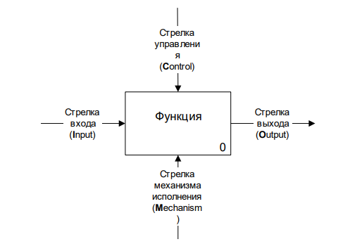
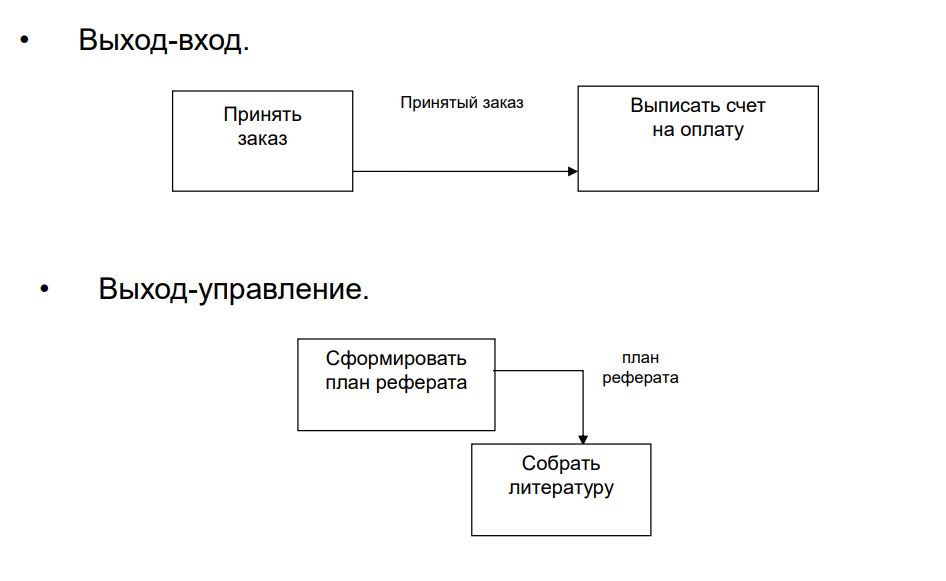
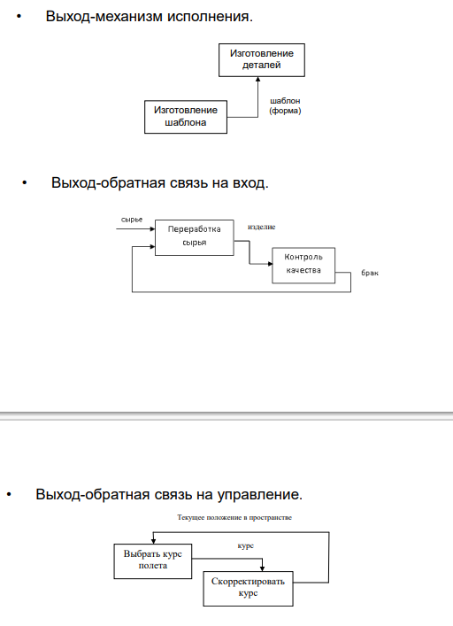
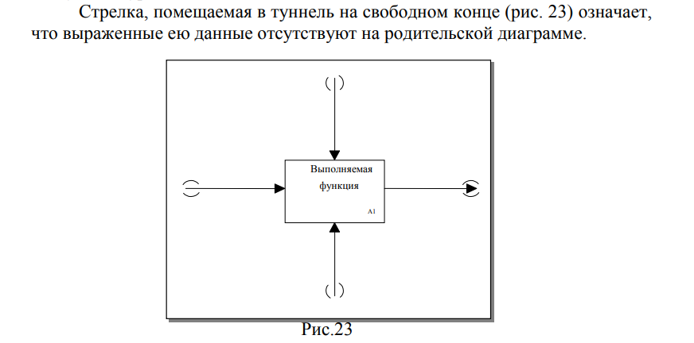
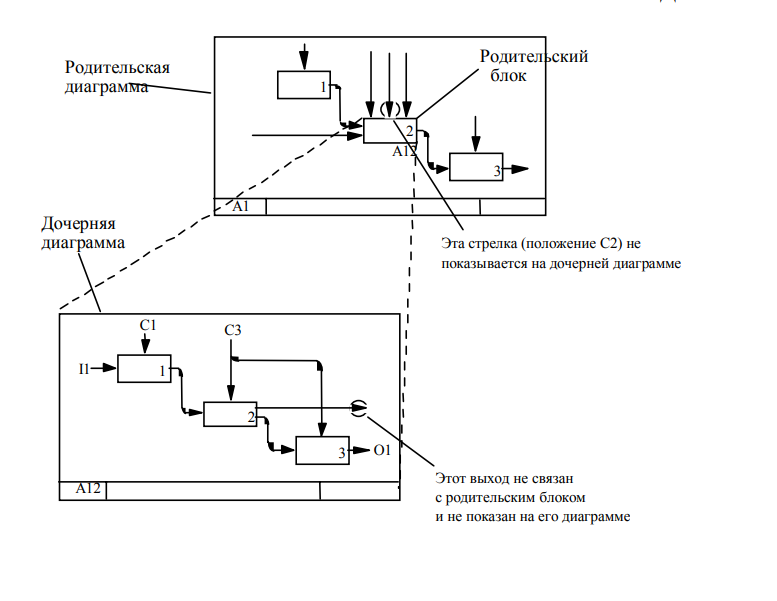
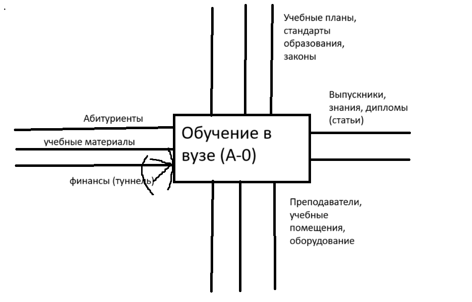
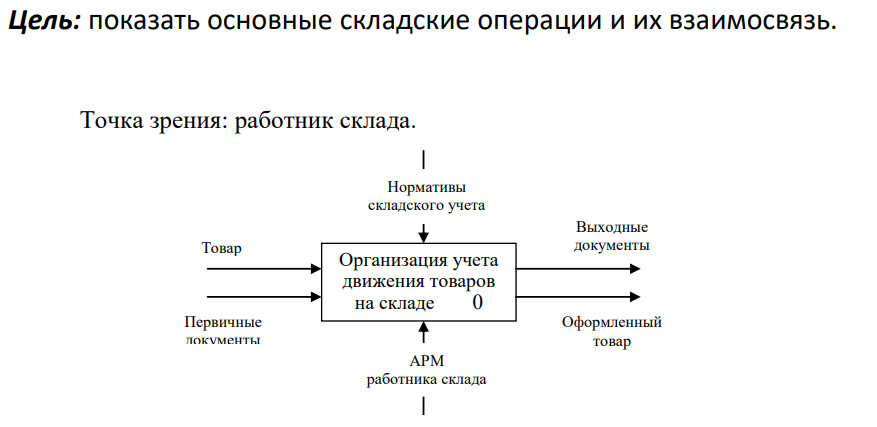

# 6 Билет

Метод IDEF0. Нотация IDEF0. Правила соединения блоков. Туннелирование. Порядок построения модели IDEF0

## Метод
метод создания функциональной модели, отображающей структуру и функции системы, а также потоки информации и материальных объектов, связывающие эти функции
	(язык описания бизнес-процессов)
		соподчиненность объектов. В IDEF0 рассматриваются логические отношения между работами, а не их временна́я последовательность (поток работ).
			описания системы в целом как множества взаимозависимых функций (действий). ==Функции системы исследуются независимо от объектов, обеспечивающих их выполнения==. Такая сугубо «функциональная» точка зрения позволяет четко ==отделить аспекты назначения системы от вопросов ее реализации==. IDEF0 часто используется как способ исследования и проектирования систем на логическом уровне. Результаты анализа с помощью IDEF0 могут применяться при проектировании с использованием DFD.
## Нотация
IDEF0 определяет два графических объекта:
1. Блок, с помощью которого обозначается некоторая функция (действие).
2. Стрелка, с помощью которой указываются информационные или материальные объекты.

Наименование функции (обязательно должно быть) должно характеризовать процесс и состоять из глагола или отглагольного существительного с дополнением. Наименование должно соответствовать выбранной точки зрения моделирования. Для функционального блока обязательно должно быть указано наименование.

1. Вход (Input, I).
	необязательно
		==информация или сырьё==, потребляемое или преобразуемое функциональным блоком для производства выхода
2. Управление, или контроль (Control, C).
	обязательно
		стандарты, правила, инструкции
		определяют ==чем регулируется выполнение функции== 
3. Выход (Output, O).
	обязательно
		==информация или продукт, которые получаются по завершению функционального блока==
			Важно, чтобы наименования входных и выходных стрелок различались
4. Исполняющий механизм
	необязательно
		персонал, оборудование
			с помощью чего и ==посредством которого выполняется== моделируемое действие

Блоки идут сверху вниз, слева направо (первый в верхнем левом углу)

Контекстная диаграмма:

## Правила соединения блоков
Все блоки нумеруются. Номер имеет вид <префикс><цифра>. Префикс представляет совокупность некоторой строки (обычно символ “A”) и номера родительского блока. Для блоков первого уровня детализации номер родительского не указывается. Контекстная функция обозначается как A0, декомпозирующие ее блоки — A1, A2, A3,... Далее, блок A1 может декомпозироваться на A1.1, A1.2,...; A1.1 — на A1.1.1, A1.1.2,... Точки обычно не ставятся, поскольку на грамотно построенной диаграмме не бывает больше 6-7 блоков. Т.е.: A0, A1, A11, A111,...

Общие рекомендации по построению модели: 1. На каждом уровне представлять не более 3-6 функциональных блоков. 2. Не загромождать диаграмму несущественными на текущем уровне функциями и объектами. 3. Одновременно вести декомпозицию функций и объектов. 4. При определении связанных блоком стрелок сначала стараться описать стрелки выходов и управления, поскольку их наличие обязательно. Если не ясно, относить ли стрелку к входу или управлению, то следует выбирать последнее. Следует помнить, что управление можно рассматривать как особый вид входа. 5. Следует выбирать ясные и полные наименования элементов.

все стрелки, связанные с рассматриваемым функциональным блоком, должны присутствовать на декомпозирующей его диаграмме (если таковая имеется). Исключения из этого правила взаимоувязанные стрелок возможно только в случае использования механизма туннелирования.
## Туннелирование

## Порядок построения модели
1. Определение цели моделирования.
2. Определение точки зрения (непосредственный исполнитель процесса, управленец, внешний аналитик и т.п.).
Модель должна разрабатываться исходя из единственной и заранее определенной точки зрения. Это обеспечивает внутреннюю целостность и в значительной степени предотвращает постоянное изменение структуры.
Определение цели моделирования и точки зрения позволяют выявить границы моделирования: ширину и глубину охвата. Часто строится целый набор моделей для разных точек зрения.

# [[Билет 9]]
# 26

Построить модель IDEF0 для процесса обучения в вузе.

### Контекстная диаграмма А0

### Декомпозиция первого уровня (А1-А4)

# 29

# 32

Построить модель IDEF0 для организации складского учета

