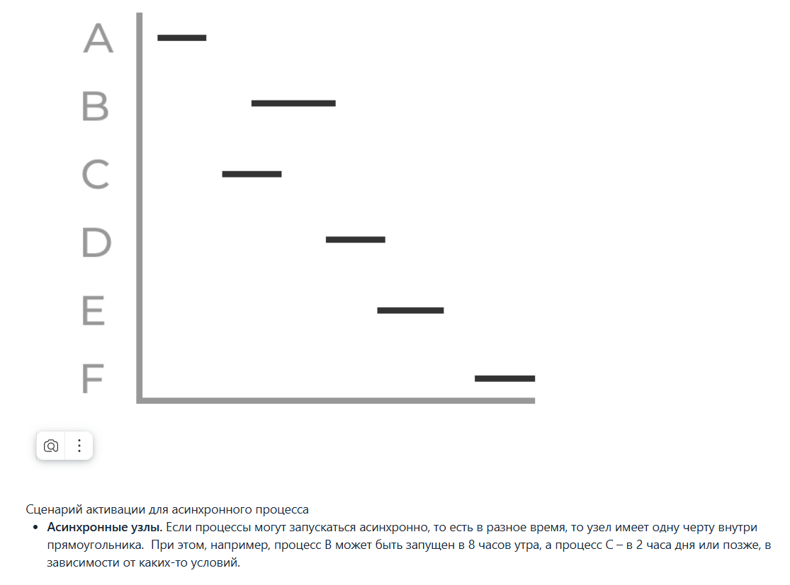
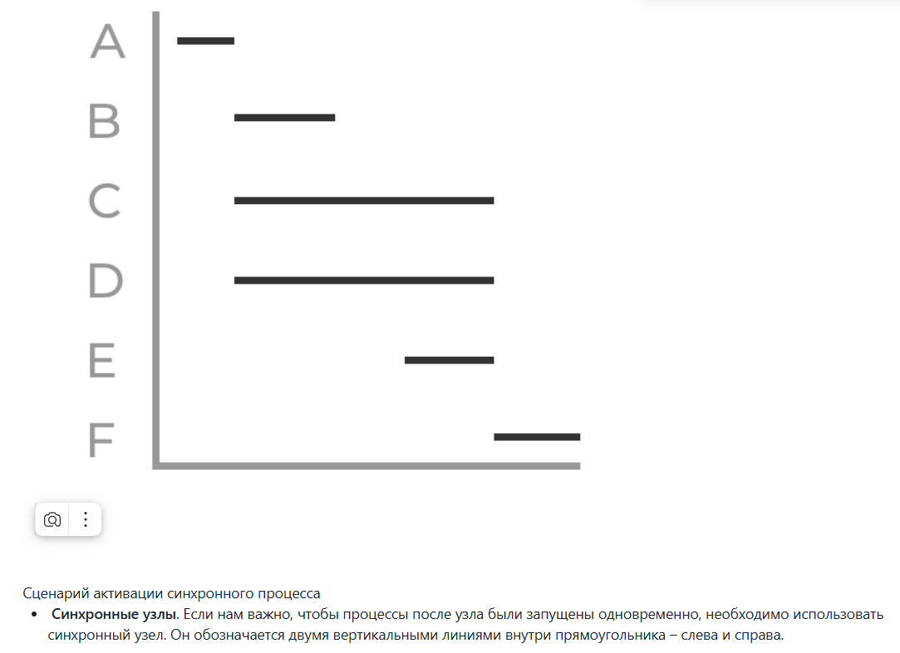
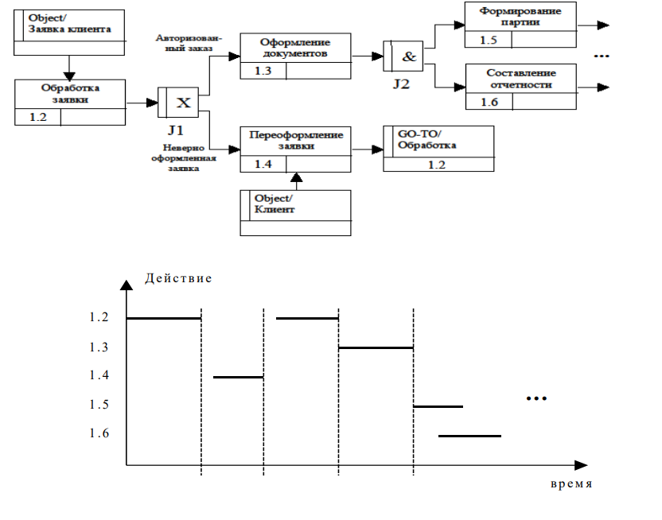
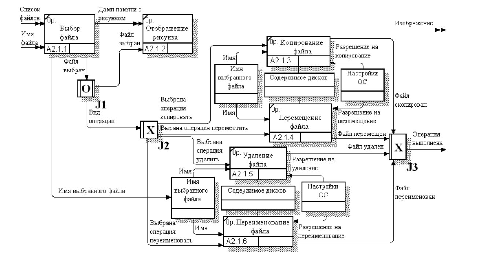
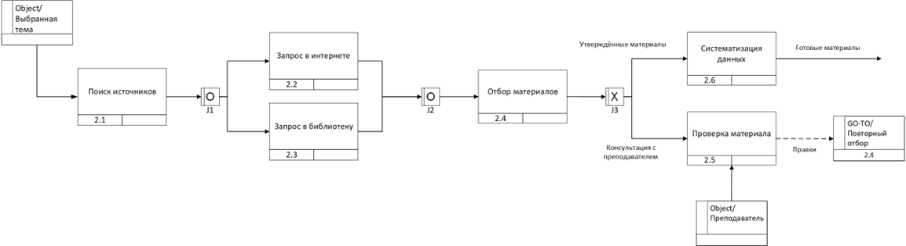
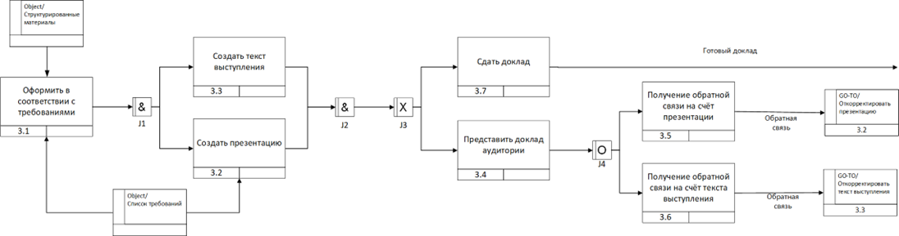
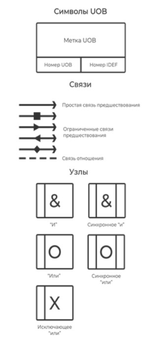
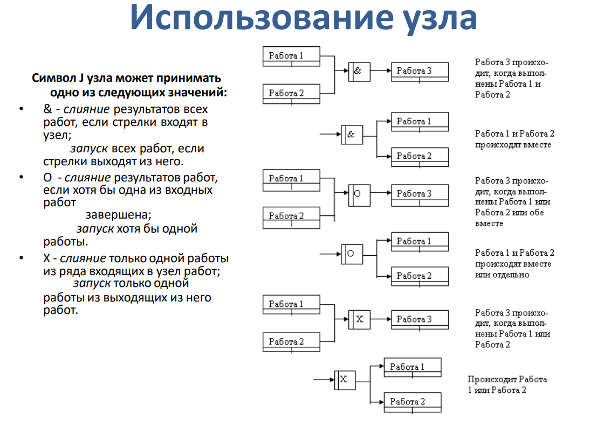
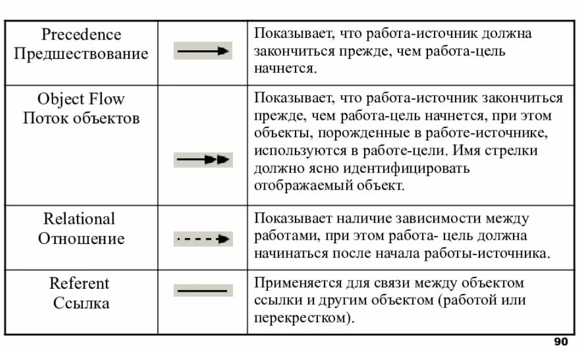

# 8

## Метод IDEF3
способ описания процесса как ==упорядоченной последовательности событий вместе с описанием объектов==, имеющих отношение к этому процессу. Метод не имеет жестких ограничений по синтаксису и семантике. Часто используется как детализация методов IDEF0 и DFD.
## Основные графические элементы
- Действия – соответствуют по смыслу ==функции== IDEF0 или процессу DFD
- UOB (Unit Of Beheavor) Единицы поведения. Любые виды ==действия, процессы==
- Object – Ссылочный объект, описывает элемент необходимый для работы, но не выполняющий конкретного действия (не имеет номера UOB)
- GOTO – Используется для реализации ==цикличности выполнения== некоторого действия (не имеет номера UOB)
- Связи – это связующее звено между функциональными элементами (UOB), отражающие порядок протекания процессов:
	- Временное предшествование – указывает на то что один процесс A выполняется после другого B
	- Поток данных (объектный поток) – указывает на то что на вход A подаётся результат работы B
	- Нечёткое отношение – подчёркивает возможную, связь A и B, не несущую строгих ограничений
- Узлы – это точки, в которых могут сходиться несколько связей, после чего снова расходиться. Используются для распараллеливания процесса, бывают синхронными и асинхронными:
	- И – указывает, что все действия ведущие в этот узел должны завершиться, либо все действия выходящие из этого узла должны начаться
	- ИЛИ – после узла могут запускаться один или несколько подпроцессов, в зависимости от условия, которое выполняется в узле
	- ИСКЛЮЧАЮЩЕЕ ИЛИ – выполняется только одна ветка, в точности подходящая под нужные условия
Также узлы делятся на:
Синхронное соединение – действия должны начаться/завершиться одновременно.
Асинхронное соединение – действия не обязаны начаться/завершиться одновременно.
## Соединения синхронные и асинхронные
Здесь речь идет о параллельно запущенных процессах в результате узла И или не исключающего условного ИЛИ

# [[Билет 9]]
# 28
# 31
# 34

# Пример 

