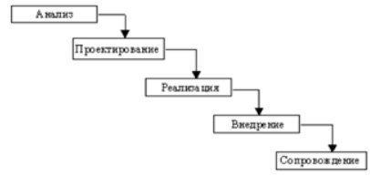
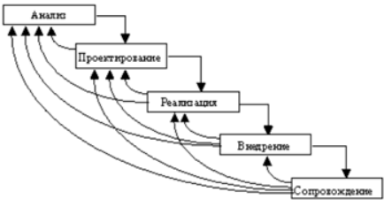
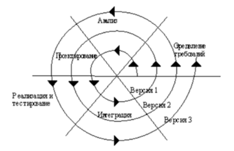

## 1. Информационная система. Определение информационной системы, архитектуры информационной системы. Компоненты информационных систем. Структура информационных систем.

### Определение
- Информационная система - ==совокупность== содержащейся в базе данных ==информации и информационных технологий==, а также технических средств, обеспечивающих ее обработку
- База данных – ==совокупность данных==, организованных в соответствии с концептуальной ==структурой==, описывающей характеристики этих ==данных и взаимоотношения== между ними.
- Архитектура информационной системы - концепция, ==определяющая модель==, структуру, выполняемые функции и ==взаимосвязь компонентов== информационной системы.
### Компоненты
1) Информация (БД/Хранилище информации, источники информации и т.д.)
2) Процедуры (Алгоритмы, функции, инструкции и т.д.)
3) Оборудование (Сервера, ПК, камеры, телефоны и т.д.)
4) Персонал (Сотрудники, администраторы, пользователи и т.д.)
### Структура
две взаимодействующие части:
1) Функциональная часть - решает комплекс прикладных задач, характеризующийся высокой степенью ==информационных обменов между задачами==.
	- Подзадачи
	- Задачи
	- Модели и алгоритмы
2) Обеспечивающая часть - является ==средством реализации управления== системы:
	1) информационное обеспечение, в состав ИС которого входят классификаторы технико-экономической информации, нормативно-справочная информация, ==форма представления и организация данных в системе==, протоколы обмена данными;
	2) программное обеспечение : (программные средства с программной документацией на них) ==ПО==
	3) лингвистическое обеспечение (тезаурусы, языки описания и манипулирования данными) ==ЯП, UML== ...
	4) математическое обеспечение: ==методы решения задач управления, модели и алгоритмы==;
	5) техническое обеспечение: технические ==средства, необходимые для реализаций функций== ИС (ЭВМ, принтеры, многоф. устр-ва);
	6) организационное обеспечение: ==документы==, ==определяющие функции подразделений== управления, действия и взаимодействие персонала ИС;
	7) правовое обеспечение: нормативные ==документы==, ==определяющие правовой статус ИС, персонала ИС==, правил функционирования ИС и нормативы на автоматически формируемые документы.
## 2. Свойства информационных систем. Особенности современных информационных систем. Классификация информационных систем.

### Свойства
Каждая система обладает свойствами делимости и целостности.
Потребительские свойства ИС:
1) Функциональная полнота – способность системы обеспечивать ==получение всей необходимой== пользователю информации на некотором заданном интервале времени 
2) Функциональная надёжность – способность системы обеспечивать ==получение безошибочной/ неискаженной== информации ==в заданные сроки==
3) Временная обеспеченность – способность системы обеспечивать ==получение нужной информации в требуемое время==
4) Эффективность – способность системы решать поставленные задачи в ==минимальные сроки ИЛИ способность системы приносить пользу==
5) Адаптивность – ==способность системы приспосабливаться== к частично изменившимся условиям и обеспечивать ==устойчивое функционирование на большом интервале времени==
6) Иерархичность – способность системы ==быть составной частью системы более высокого уровня или содержать в себе системы более низкого уровня==
### Особенности
- сложность описания (достаточно ==большое количество функций, процессов, элементов данных== и сложные взаимосвязи между ними, требующая тщательного моделирования и анализа данных и процессов).
- наличие совокупности ==тесно взаимодействующих компонентов==(имеющих локальные задачи и цели функционирования)
- ==отсутствие полных аналогов==, ограничивающее возможность использования каких-либо типовых проектных решений и прикладных систем.
- функционирование в неоднородной среде ( ИС работают с ==данными, представленными в разных форматах, на различных аппаратных платформах== и с использованием разных моделей представления информации)
- необходимость интеграции существующих и вновь разрабатываемых приложений.
### Классификация
1) По степени формализации задачи:
	- Формализованные – ==известны все элементы задачи и взаимосвязи между ними, имеется чёткий алгоритм решения==, математическая модель, ==роль человека минимальна== (бухгалтерские ИС, банковские ИС, логистические ИС)
	- Неформализованные – ==элементы задачи и взаимосвязи между ними (почти) неизвестны, задачу невозможно либо очень сложно описать алгоритмически==, возможности использования системы ограничены, ==роль человека максимальна== (ИС оценки на базе мнений или психологических портретов).
	- Частично формализованные - ==известны не все элементы== задачи и взаимосвязи между ними, алгоритм решения или некоторые его ==этапы нечётки==, ==роль человека значительна==, такой класс ИС встречается чаще всего (экспертные ИС, репортинговые ИС)
2) По назначению:
	- Маркетинговые – основные задачи: анализ рынка и продаж, организация ==рекламной кампании== 
	- Производственные – основные задачи: ==создание== и внедрение научно-==технических новшеств==
	- Финансовые и учётные – основные задачи: контроль, анализ и ==управление финансовыми ресурсами==, бухгалтерия и статистика
	- Кадровые – основные задачи: ==подбор и расстановка персонала==, определение функций сотрудников
	- Прочие
3) По уровню управления:
	- Стратегические – ==системы поддержки топ-менеджмента==. Назначение систем – ==поддержка в принятии решений== по реализации перспективных ==стратегических целей== компании
	- Тактические – ==системы поддержки менеджеров среднего звена==. Назначение систем – ==анализ показателей, работа с архивной информацией==, статистический анализ, составление отчётов за средний промежуток времени
	- Операционные – ==системы поддержки специалистов/исполнителей==, учёта сделок/событий. Назначение систем – ==отвечать на запросы о текущем состоянии==, отслеживать поток сделок в фирме, составлять отчёты о произошедших события.
4) По степени автоматизации:
	- Автоматизированные – неполная автоматизация. ==Требуется постоянное участие персонала==
	- Автоматические – полная автоматизация. Участие персонала ==не требуется или требуется относительно редко==
5) По сфере применения:
	- ИС ==управления технологическими процессами== для автоматизации функций производственного персонала. Они широко используются при организации ==поточных линий==, изготовлении микросхем, ==на сборке==, для поддержания технологического процесса в судостроительной, электронной, металлургической и машиностроительной промышленности
	- ИС ==автоматизированного проектирования== предназначены для автоматизации функций инженеров-проектировщиков, конструкторов, архитекторов, дизайнеров при создании новой техники или технологии
	- ==Интегрированные (корпоративные) ИС для автоматизации всех функций фирмы и охватывающие весь цикл работ== от проектирования до ==сбыта продукции==. Создание таких систем весьма затруднительно, поскольку требует системного подхода с позиций главной цели, например, получения прибыли, завоевания рынка сбыта и т. д.
6) По характеру использования информации:
	- Управляющие – обеспечивают получение решения на основе ==автоматизации информационных процессов в сфере управления==, на основе которой человек принимает решение (1С:Предприятие)
	- Информационно-справочные системы – производят ==ввод, систематизацию, хранение, выдачу информации по запросу пользователя без сложных преобразований== данных (Библиотечная система)
	- GIS – системы, работающие с ==географическими данными==, позиционированием, картами и т.д. (2GIS) 
	- Информационно-поисковые (ИПС) – осуществляют ==поиск информации без её обработки== (гугл) 
	- Документальные ИПС – осуществляют создание, хранение, обработку и ==поиск документов==. Отличительная черта – присвоение каждому документу ==уникального кода==, составляющего поисковый образ (библиотечная система) 
	- Фактографическая ИПС – работает по принципу ==документальной, но вместо документов использует факты/выдержки==, проассоциированные с содержимым (википедия)
	- Информационно-решающие системы – помимо поиска осуществляют функции ==вычисления некоторых значений== на базе хранящейся информации или иных способов её обработки (КонсультантПлюс) 
	- Советующие – ==Вырабатывают информацию, которая принимается человеком к сведению== и не превращается немедленно в серию конкретных действий. Эти системы обладают более высокой степенью интеллекта, так как для них характерна обработка знаний, а не данных (системы постановки мед. диагноза)
7) По масштабу:
	 - Локальная – предназначена для решения ==некоторого круга задач одного человека или одного уровня предприятия== 
	 - Корпоративная – ==автоматизирует все бизнес-процессы целого предприятия или их значительную часть== (такие системы иногда называют информационными системами предприятия и системами комплексной автоматизации предприятия)
## 3. Жизненный цикл информационной системы. Структура жизненного цикла. Модели жизненного цикла.
### Жизненный цикл информационной системы
- ==весь период существования ИС==, начиная от выработки ==решения о ее создании==, до прекращения её использования.
### Этапы жизненного цикла:
1. Анализ – исследование и анализ предметной области и существующих ИС, ==определение требований== к создаваемой ИС и ==оформление== технико-экономического ==обоснования== и технического ==задания на разработку ИС==.
2. Проектирование – ==разработка состава== автоматизируемых ==функций==, состава обеспечивающих подсистем, ==оформление технического проекта== ИС.
3. Реализация – ==разработка и настройка программ, создание и наполнение баз данных==, создание рабочих инструкций для персонала, ==оформление рабочего проекта==.
4. Внедрение – комплексная ==отладка подсистем==, ==обучение== персонала, поэтапное ==внедрение ИС== по подразделениям предприятиям, оформление акта о приёмо-сдаточных испытаниях ИС.
5. Эксплуатация (сопровождение) – ==сбор рекламаций и статистики о функционировании ИС==, ==исправление ошибок== и недоработок, оформление требований к ==модернизации ИС== и её выполнение (повторение этапов 2-5).
### Модели жизненного цикла
#### Каскадная

Особенности:
- На каждом этапе формируется ==законченный набор== проектной ==документации==.
- Имеется возможность ==планирования сроков завершения== всех работ и соответствующих ==затрат==.
- ==Реальный процесс создания== ИС никогда полностью ==не укладывается== в такую жёсткую схему.
- В начале проекта ==требования заказчика реально определены лишь частично==.
- ==Результаты== разработки доступны заказчику ==только в конце== проекта.
#### Инкрементная

Особенности:
- Подразумевает разработку ИС в несколько инкрементов, т.е. с ==запланированным улучшением продукта==.
- В отличие от классической стратегии ==заказчик может раньше увидеть результаты==.
- Используется при разработке ==сложных и комплексных систем==.
#### Спиральная

Особенности:
- Позволяет ==быстрее показать== заказчику работоспособный ==продукт==
- ==Допускает изменение требований== при разработке ИС 
- Обеспечивает ==большую гибкость в управлении== проектом 
- Позволяет ==совершенствовать процесс== разработки 
- ==Уменьшаются риски== заказчика
- ==Затруднены== операции временного и ресурсного планирования всего проекта в целом
## 4. CASE-технология. Современные CASE-средства, ориентированные на проектирование ИС.
### CASE-технология
Представляет собой ==совокупность методологий== анализа, проектирования, разработки и сопровождения сложных ИС, ==поддерживаемую комплексом== взаимоувязанных ==средств автоматизации==
### Современные CASE-средства
1) Репозиторий – ядро любого CASE-средства, ==разделяемая корпоративная БД==, содержащая информацию об объектах проектирования, надмножество словарей метаданных. 
2) Графический редактор диаграмм – предназначен для ==создания, модификации и отображения диаграмм==, которые описывают модель ИС или её компоненты.
3) Нотация - отображение ==структур системы== с помощью специальных графических символов.
4) Верификатор диаграмм - часть ПО, контролирующая ==правильность построения диаграмм== в рамках определённого метода.
5) Документатор проекта – отвечает за ==построение различных отчётов==
6) Сервисы – утилиты по ==обслуживанию репозитория== (архивация, восстановление, создание, удаление)

Основная цель технологии — ==отделить проектирование ПО от его кодирования и последующих этапов разработки==, чтобы разработчик мог заниматься проектированием на более высоком уровне, не отвлекаясь на детали (**Bizagi**, ERwin)
## 5. Особенности структурного (функционально-ориентированного) подхода. Особенности объектно-ориентированного проектирования

### структурного (функционально-ориентированного) подхода

Сущность структурного подхода к разработке ИС заключается в её ==декомпозиции на автоматизируемые функции==: система разбивается на функциональные подсистемы, которые в свою очередь делятся на подфункции, подразделяемые на задачи, и т.д. В рамках этого подхода отдельно и независимо строятся функциональные модели и модели данных:
Принципы:
1) Декомпозиция – принцип решения сложных проблем путём их ==разбиения== на множество меньших независимых задач, лёгких для понимания и решения.
2) Иерархическое упорядочивания уровней – принцип организации составных частей проблемы в иерархические ==древовидные структуры== с добавлением новых деталей на каждом уровне.
3) Абстрагирование – ==выделение существенных аспектов== системы и ==отвлечения от несущественных==.
4) Формализация – необходимость ==строгого методического подхода== к решению проблемы.
5) Непротиворечивость – ==обоснованность и согласованность== элементов
6) Структурирование данных – данные должны быть ==структурированы и иерархически== организованы.
### объектно-ориентированного проектирования
- Система разбивается на ==набор объектов==, которые, как правило, соответствуют объектам реального мира, взаимодействующих между собой путём ==посылки сообщений== 
- Иерархия выстраивается с использованием двух отношений: ==композиции и наследования==. При этом «объект-часть» может включаться сразу в несколько «объектов-целое». Таким образом, модуль представляется в виде ориентированного графа
Понятия:
- Объект – ==абстракция или любая вещь== с чётко очерченными границами, имеющая смысл в контексте рассматриваемой прикладной области. Все объекты ==отличны== один от другого. 
- Класс объектов – абстрактное понятие, объединяющее объекты. Общий ==шаблон==.
- Атрибут объекта – ==значение==, характеризующее свойство объекта (цвет, форма, вес и т.д.).
- Метод – ==реализация операции==/действия для/над объектом класса.
Основные принципы:
- Инкапсуляция – ==сокрытие информации==, разделение элементов абстракции на секции с различной видимостью. 
- Наследование – возможность создавать ==из классов новые классы== по принципу «от общего к частному». Наследование позволяет новым классам при сохранении всех свойств классов родителей ==добавлять свои черты==.
- Полиморфизм – способность объектов ==выбирать метод на основе типов данных==, применяемых в сообщении. Каждый объект может реагировать по-своему на одно и то же сообщение.
- Модульность – способность ==подвергаться декомпозиции== на ряд сильно связанных и слабо сцепленных модулей.
- Абстрагирование – заключается в ==фиксации основных значимых характеристик объекта==. Эти характеристики отличают его от других объектов и позволяют сформировать ясные границы понятия объекта.