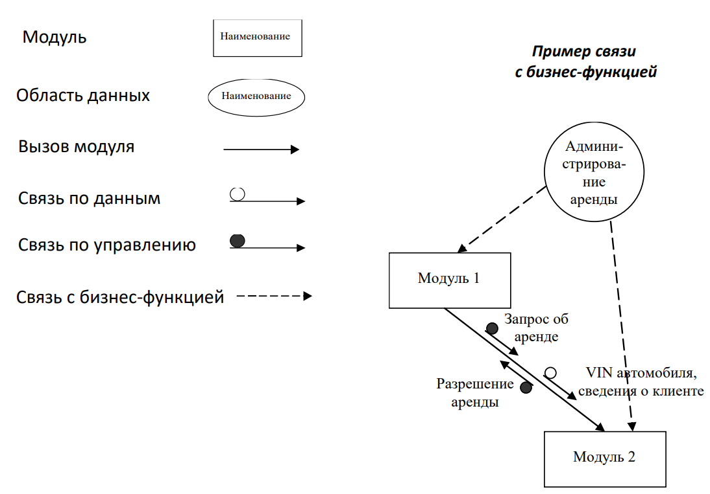
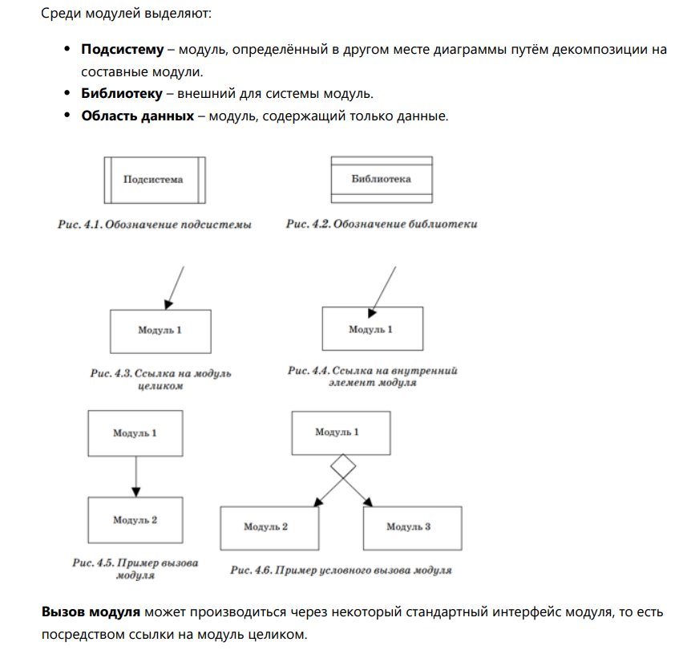
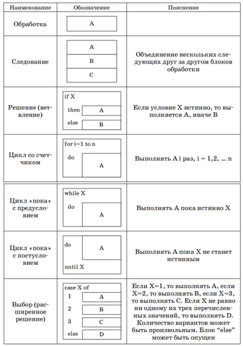
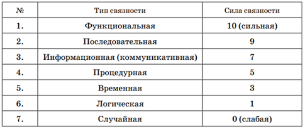
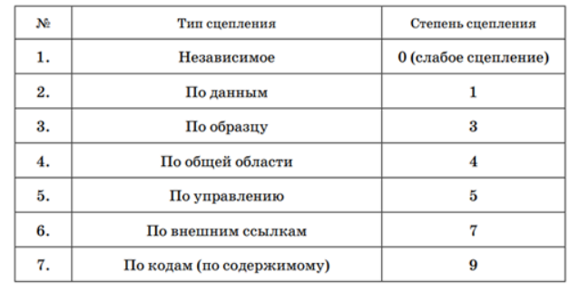

# 10
## Методы модульного проектирования
Модуль - программный объект, обладающий характеристиками:
- представляет собой ==множество операторов, записанных последовательно==;
- может ==принимать и передавать данные==;
- имеет имя.
Методы: 
1) описания ==внутренней структуры модулей== (блок-схемы, FLOW-формы), 
2) описания ==внешней== структуры программного комплекса - ==состав модулей и их взаимоотношения== (структурные карты Константайна).
## Структурные карты Константайна
позволяют указывать ==состав и взаимосвязи программных модулей==, а также ==взаимосвязи== между функциями системы и реализующими их модулями

Связь с бизнес-функцией позволяет указать, ==какие именно модули реализуют== функции системы.
Связь по данным и связь по управлению позволяют ==конкретизировать тип вызова модуля и указать параметры== вызова.
## FLOWформы
 позволяют изображать ==поток передачи управление== не с помощью явного указания линий переходов по управлению, а с помощью ==вложенности типовых структур==. Каждый символ FLOW-формы является блоком обработки. Каждый символ имеет вид прямоугольника (блока) и может быть вписан в любой внутренний блок любого другого символа.
# 11

## Проектирование программных модулей
Связность модуля - это мера независимости его частей. Чем ==более зависимы части, тем выше связность==. Считается, что чем выше связность модуля, тем лучше результат проектирования.

1. Функциональная – выполняет ==единственную функцию== и реализуется последовательностью операций в виде ==единого цикла==. ==Не может быть разбит== на функциональные части
2. Последовательная – может быть разбит на последовательные части, выполняющие ==независимые подфункции, но совместно реализующие единственную функцию==
3. Информационная – модуль составлен из ==независимых модулей, разделяющих одни и те же данные==. ==Общая структура данных== является основой организации модуля
4. Процедурная – соответствует «лобовому» ==разбиению действий алгоритма программы на модули==. Например, такая структура может возникнуть при расчленении длинной программы на части в точках передачи управления, но без учёта каких-то функциональных критериев при выборе разделительных точек, так что решение какой-то подфункции может «размазываться» по нескольким модулям
5. Временная – содержит ==конструкции, которые функционально не связаны, но необходимы в один и тот же момент обработки==
6. Логическая – объединяет процедуры по ==признаку их функционального подобия==
7. Случайная – его элементы объединены произвольным образом. Такой тип связности свидетельствует об ошибках проектирования
## Критерии

Сцепление модулей – это мера относительной ==независимости модулей==. Данная характеристика является до некоторой степени обратной связности модулей.  ==слабее лучше==

1. Независимое – модули ==не вызывают друг друга и не используют общих данных==. Такие модули не сцеплены
2. По данным – модули имеют ==общие переменные==, ==передаваемые== от одного к другому ==как параметры==
3. По образцу (по типу) – параметры представляют собой структуры данных. Сцепление сильнее, чем в предыдущем случае, поскольку оба модуля должны ==знать о внутренней структуре данных==, потенциально подверженной изменениям
4. По общей области – модули используют ==одну и ту же глобальную переменную (структуру данных)==.
5. По управлению – один из модулей ==управляет вычислительным процессом другого== с помощью передачи флагов или переключателей. То есть один из модулей «знает» внутреннюю структуру другого.
6. По внешним ссылкам – один модуль имеет ==доступ к данным другого== через внешнюю точку входа
7. По кодам (по содержимому) – один модуль ==может передавать управление внутренним областям другого без обращения к некоторым точкам входа==. Такое сцепление часто возникают при программировании на языках низкого уровня при оптимизации кода по критерию размера и/или времени выполнения.