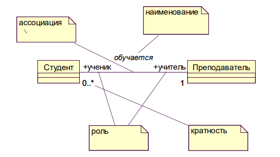
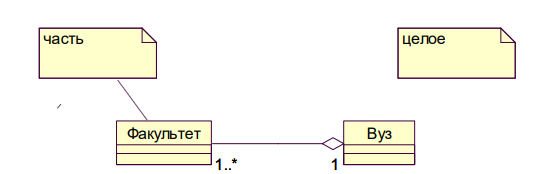
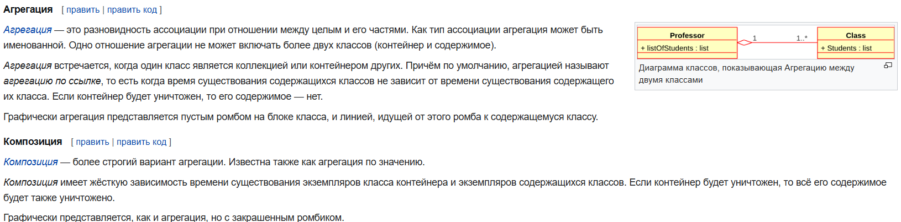
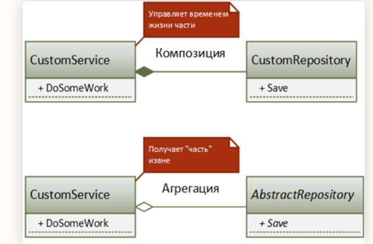
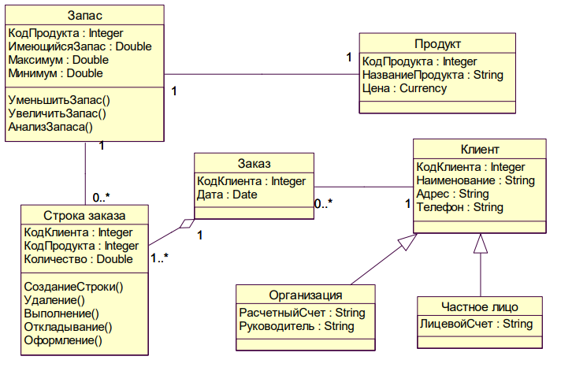
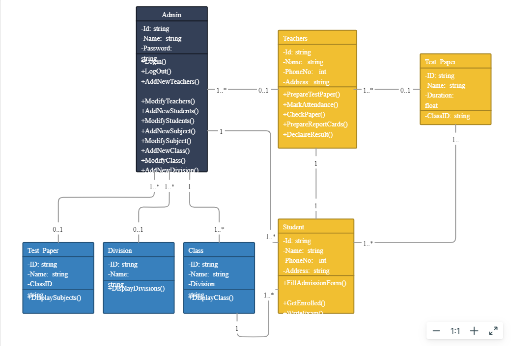

[[UML]]

## 16

Диаграмма классов — это граф, узлами которого являются элементы статической структуры проекта системы (классы, интерфейсы и т.п.), а дугами — отношения между узлами (ассоциации, наследование, зависимости). Диаграмма классов основана на распространенной модели «сущность-связь» (Entity Relationship Diagram, ERD), но обычно обладает большими возможностями по спецификации свойств сущностей и их отношений. 
Диаграммы классов являются основным средством моделирования статического вида системы.
Обычно диаграммы классов используют в следующих целях:
1. моделирование словаря предметной области, в ходе которого определяется состав и назначение абстракций, являющихся частью системы;
2. моделирование коопераций, позволяющее визуализировать и специфицировать отношения между элементами, входящими в кооперацию;
3. моделирование логической схемы базы данных (реляционной или объектно-ориентированной). 
Ассоциация (association) — структурное отношение, показывающее, что объекты одного типа некоторым образом связаны с объектами другого типа. Ассоциация, связывающая два класса, называется бинарной. Такая ассоциация используется чаще всего, и именно она рассматривается далее. Можно создавать ассоциации, связывающие более двух классов, они называются n-арными. Можно также указывать ассоциацию класса самим с собой, что означает структурную связь между объектами одного класса. Бинарная ассоциация изображается сплошной линией и может иметь дополнительные визуальные атрибуты, конкретизирующие свойства ассоциации. Четыре основные характеристики ассоциации:
 наименование — символьная строка, описывающая смысл отношения; имя обычно не указывается, но является полезным, например, в случае существования нескольких ассоциаций между одними и теми же классами;
 роль — описание того значения, которое имеет некоторый класс в контексте данной ассоциации; роль описывает значение одного класса относительно другого класса, связанного ассоциацией;
 кратность — описание числа объектов (экземпляров класса), которые могут быть связаны одним экземпляром ассоциации; указание кратности на одном конце ассоциации специфицирует, сколько именно объектов должно соответствовать каждому объекту на противоположном конце; кратность может указываться конкретным числом или диапазоном, например: единица — «1», несколько — «0..*», положительное количество — «1..*» и т.п.;
 агрегирование — знак того, что ассоциация имеет характер отношения «часть-целое», когда один класс в той или иной форме является частью другого; факт агрегирования показывается с помощью незакрашенного ромба со стороны класса более высокого ранга («целого»); базовая форма агрегирования является чисто концептуальной и показывает, что объект одного класса может агрегироваться объектом другого класса или даже несколькими объектами, что, например, не задает каких-либо зависимостей по времени жизни между объектами.

Пример изображения того, что класс «Студент», играющий роль ученика, ассоциирован с классом «Преподаватель», играющим роль учителя:

Пример использования агрегирования:

Ассоциация :  оба объекта знают о существовании друг друга. Пример — доктор и пациент: доктор знает о пациенте, а тот, в свою очередь, знает о докторе
Агрегация :   **однонаправленную** связь, когда один объект выступает в качестве части другого. Например, автомобиль и его детали: детали можно вытащить, а автомобиль всё равно останется
Композиция : комната не может быть без дома, а дом без комнат
P.S. Если очень хочется использовать пример из реального мира, то для объяснения композиции и агрегации может подойти ... отвертка. Если отвертка цельная, т.е. ручка и насадка намертво связаны друг с другом, то мы имеем отношение **композиции**. Если же насадка съемная и может существовать без ручки или же использоваться с другой ручкой, то мы имеем отношение **агрегации**.
## 35

## 36

## 37

## 38

## 39
