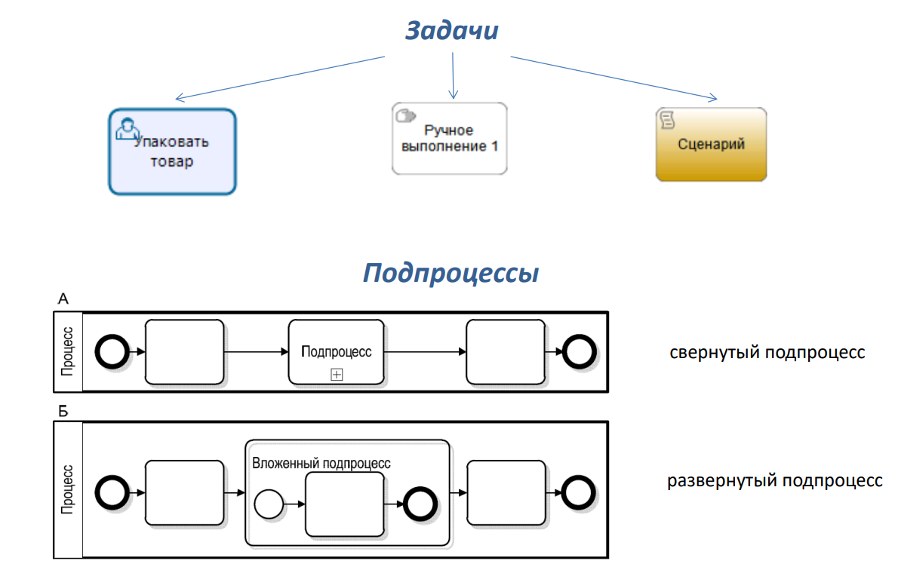
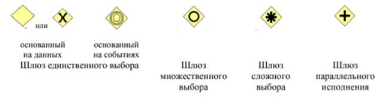
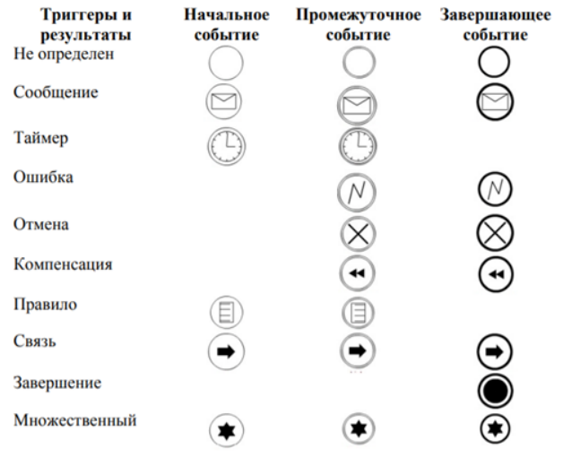
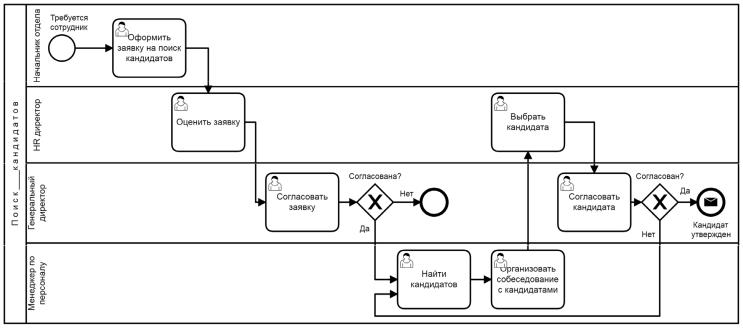
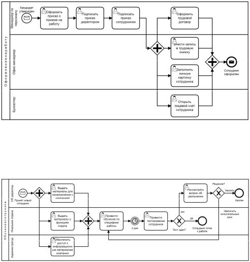
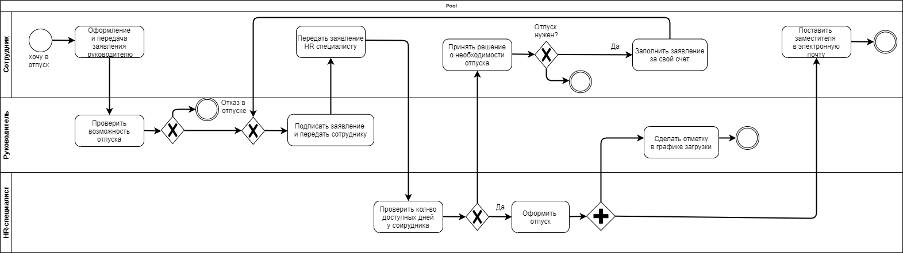
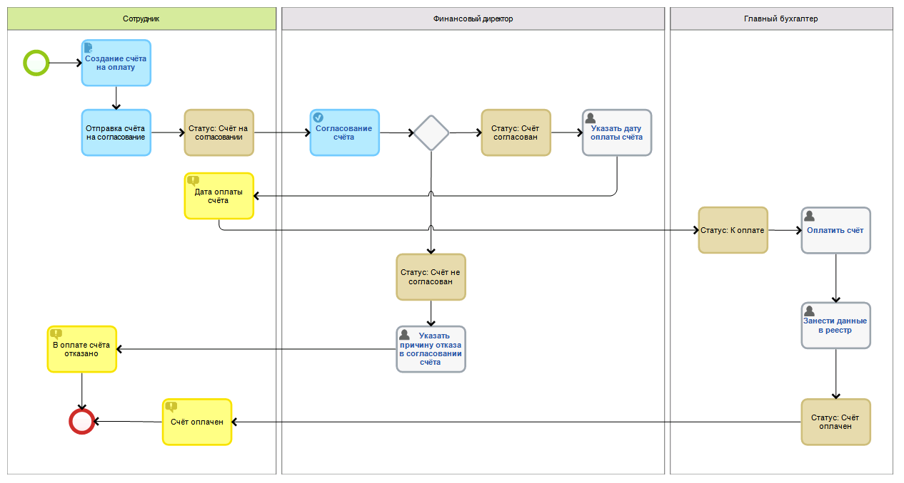

# 23 BPMS. Основные стадии внедрения процессов
## BPMS
(Business Process Management System) - системы ==управления бизнес-процессами==; это основная технология для поддержки концепции BPM в компании. Система управления бизнес-процессами позволяет ==моделировать процессы компании и автоматизировать их исполнение==, предоставляет возможность контролировать работу на всех этапах и быстро вносить улучшения.
Основная цель BPMS — осуществление программной ==поддержки процессного управления== в организациях.
Бизнес-процесс – это логическая последовательность действий человека (или нескольких человек) в коллективе

## Стадии внедрения
1. ==Проектирование== (моделирование) процесса с помощью встроенного дизайнера бизнеспроцессов. Как правило все современные BPMS работают с нотацией BPMN и визуализируют готовый процесс в виде блок схемы. Это позволяет понимать и работать со схемами не только профильным специалистам и бизнес-аналитикам, но и людям бизнеса
2. ==Исполнение процесса== с помощью движка (ядра) BPM. После старта процесса система автоматически разошлёт уведомление всем участникам, сопровождая их задачей и регламентом срока на выполнение. BPMS может взаимодействовать со сторонними ИТ-системами для повышения эффективности. На данном этапе очень важна скорость работы BPM-движка так как в крупных компаниях одновременно могут выполняться сотни, а иногда и тысячи процессов
3. ==Мониторинг и контроль за выполнением== с помощью удобных графических дашбордов. BPMсистема уведомит ответственного за процесс об отклонении от временных и других плановых показателей. Руководитель получает информацию о проблемных процессах, их участниках для скорейшего принятия решения в режиме реального времени
4. ==Улучшение процесса== на основе полученных данных после выполнения процессов. Возможность гибкой настройки, масштабирования и быстрой адаптации BPMS к новым бизнес-условиям делает данный инструмент особо важным в современном мире
# 24 Основные элементы в нотации BPMN: действия, шлюзы, события.
## Действия
(изображаются прямоугольниками с закруглёнными углами):
- Пользовательская задача – самая распространённая Задача, где человек участвует в качестве исполнителя
- Ручное выполнение – представляет собой Задачу, выполнение которой подразумевает действия человека и исключает использование каких-либо автоматизированных механизмов исполнения или приложений
- Задача-сценарий – выполняется без участия человека, обозначает выполнение в процессе некоторого автоматизированного действия Составные действия называются подпроцессами
- 
## Шлюзы
(изображаются ромбами и представляют точки принятия решений в процессе)

Х - или (только одно)
O - можно запускать и выходить если пришёл только один

## События
служат для обозначения различных событий, которые могут ==начать, прервать и закончить ход процесса==. Изображается в виде круга со свободным центром.
- Стартовые (начальные) – указывают на то, в какой точке ==берет начало== тот или иной процесс
- Конечные – указывают на то, в какой точке ==завершается== тот или иной процесс. Конечное событие представляет собой круг, выполненный одиночной, жирной линией. Толщина линии должна быть жирной настолько, чтобы без труда можно было отличить Конечное событие от Стартового.
- Промежуточные – указывает на то, что происходит на отрезке Процесса, ограниченном Стартовым и Конечным событиями. Промежуточное событие влияет на ход Процесса, однако, ==не может являться его началом или непосредственным завершением==. Промежуточное событие представляет собой круг, который должен быть выполнен двойной тонкой линией События могут быть снабжены триггерами (некоторыми условиями или ограничениями), которые отражают причину события

# 25 Основные элементы в нотации BPMN: пул, дорожка, события (выше)

## Пул
определяет область бизнес-процесса как общую зону ответственности за его исполнение
## Дорожки
Внутри пула выделяются дорожки — ==зоны ответственности== отдельных участников бизнес-процесса. Любые элементы схем в нотации, размещённые на той или иной дорожке, будут выполняться конкретными исполнителями Дорожки могут располагаться горизонтально или вертикально. Любая диаграмма бизнес-процесса в нотации BPMN содержит как ==минимум один пул==, однако в случае единственного пула его границы, как правило, не показывают. Более того, на диаграммах, содержащих более одного пула, не обязательно изображать границы «главного» пула, соответствующего бизнес-единице, для которой рассматриваемый процесс является внутренним
# 46
«Поиск кандидатов на вакансию»

# 47
«Выпуск нового продукта»

# 48
«Оформление документов нового сотрудника» и Обучение сотрудника

# 49
«Предоставление отпуска сотруднику»

# 50
«Согласование и оплата счета»
