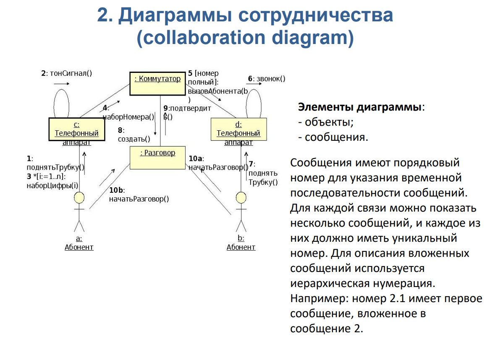

## 12 Виды
#### UML – универсальный язык моделирования
это группа взаимосвязанных элементов, характеризующих один из аспектов системы (предметной области), и отображаемая в виде графа, на котором дуги (отношения) связывают вершины (сущности).
#### Виды моделей UML. Представления модели UML (визуализация)

- Модель вариантов использования – ==функционального моделирования системы==: Диаграмма Прецедентов Диаграмма Состояний Диаграмма Классов Диаграмма Последовательности действий Диаграмма Сотрудничества
- Модель анализа – ==уточняет требования== системы с учётом внутренней организации: Диаграмма Классов Диаграмма Последовательности действий Диаграмма Сотрудничества 
- Модель проектирования – детализировано описывает внутреннюю архитектуру и алгоритмы работы системы: Диаграмма Классов Диаграмма Деятельности
- Модель реализации – определяет ==логическую и физическую организацию классов== в виде компонентов и подсистем, а также топологию информационной системы Диаграмма Классов Диаграмма Компонентов Диаграмма Развёртывания

###### примеры

## 13 сущности
 Элементы UML – сущности

Сущности — это некоторые абстрактные объекты. Сущности являются основными элементами UML.
	- Типы сущностей:
	1) структурные (статические части модели):
		1) Класс — описание ==совокупности объектов с общими атрибутами==, методами, отношениями и семантикой
			В верхней части прямоугольника записывается наименование класса, в средней перечисляются атрибуты, в нижней — методы (операции). Для атрибутов могут указываться тип и видимость. Для методов могут указываться видимость и тип возвращаемого значения.
		2) Интерфейс — описание ==совокупности методов==, которые определяют набор услуг, предоставляемых классом или компонентом
			Интерфейс описывает «видимое» извне поведение элемента через спецификацию операций. Интерфейс содержит только декларативную часть
		3) Кооперация, или сотрудничество - ==совокупность классов, интерфейсов== и других элементов, эффект от работы которых не сводится к сумме простых слагаемых
			элемент реализуется с помощью совокупности других элементов. Чаще всего кооперация используется для описания реализации прецедента
		4) Прецедент (use case) — описание ==последовательности выполняемых системой действий== (в том числе вариантных), которые приводят к наблюдаемому результату, значимому для какого-либо пользователя системы (актера).Прецеденты реализуются посредством кооперации.
		5) Компонент - ==физическая заменяемая часть системы==, которой соответствует некоторому набору интерфейсов и обеспечивает их реализацию. «обертка» для классов, коопераций
		6) Узел - это элемент реальной системы. Это ==вычислительный элемент==, который обладает машинной памятью некоторого объема и, обычно, способностью обработки
		7) Актёр - согласованная ==совокупность ролей==, которые играет пользователь системы при взаимодействии с ней. Актёром может быть как одушевленный предмет (человек-оператор), так и не одушевленный (другие ИС) 
	2) поведенческие (поведение модели во времени и в пространстве) :
		1) Взаимодействие — поведение, состоящее в ==обмене сообщениями между объектами== в рамках конкретного контекста для достижения определённой цели 
		2) Автомат — ==алгоритм поведения, определяющий последовательность состояний==, через которые проходят объект или процесс (взаимодействие) 
	3) группирующие (блоки, на которые можно разложить модель) :
		1) Пакет – ==организует элементы== в группы. Пакеты существуют только во время разработки модели, в отличие от компонентов, которые тоже выполняют функции агрегации элементов.  Элемент может принадлежать только одному пакету
	4) аннотационные (пояснения): 
		1) Примечание: словесного описания 
- Диаграмма — это группа взаимосвязанных сущностей, характеризующих один из аспектов предметной области.
- Связи между сущностями выражаются отношениями
## 14 отношения

- Зависимость – семантическое отношение, которое показывает, что ==изменение== спецификации независимой (или целевой) сущности ==влияет== на зависимую.
-  
- Ассоциация – структурное отношение, описывающее ==значимую связь== между двумя и более сущностями Четыре основные характеристики ассоциации: (Агрегация: чаще всего часть-целое не физическое как вуз факультет, а композиция физическое как двигатель машина )
	- Наименование – символьная строка, ==описывающая смысл== отношения.
	- Роль – ==описание того значения==, которое имеет класс в контексте данной ассоциации.
	- Кратность – ==описание числа объектов== (экземпляров класса), которые могут быть связаны одним экземпляром ассоциации.
	- Агрегирование – знак того, что ассоциация имеет характер отношения «==часть-целое==».
	- Обобщение – структурное отношение типа «наследование», оно показывает, что объект-потомок ==наследует== структуру и поведение родителя 
	- Реализация (интерфейс) – семантическое отношение, показывающее такую зависимость, когда ==один из элементов определяет запрос (контракт)==, а другой обеспечивает его выполнение
## 16 [[Диаграммы классов (16, 35-39)]]

Позволяют описывать структурные отношения ==между сущностями== предметной области и создавать логическое представление системы как совокупности классов, пакетов и интерфейсов, связанных статическими отношениями, обычно структурного типа. Диаграмма классов основана на распространенной модели «сущностьсвязь» (Entity Relationship Diagram, ERD). Диаграммы классов являются основным средством моделирования ==статического== вида системы.

Элементы диаграммы:
- класс;
- интерфейс;
- объект
- экземпляр класса;
- пакет;
- отношения (ассоциация, обобщение, зависимость).
- 

## 15 Диаграммы прецедентов использования
- ==совокупность операций, которые выполняет система==
На основе набора таких диаграмм формализуется и визуализируется список требований к системе и определяется множество выполняемых системой функций.
Каждая такая диаграмма — это ==описание сценария поведения==, которому следуют действующие лица, или актёры.
Данный тип диаграмм применяется на ==начальных== этапах проектирования и используется для определения ==требований== к системе, выявления действующих в системе ==объектов и== их основных ==функций==.
Элементы диаграммы: 
Прецеденты использования
Актёры
Отношения между этими сущностями (зависимость, обобщение, ассоциация) (включить/расширить)

## 18 [[Диаграмма деятельности (42-45)]]

Показывают ==переход потока управления== от одной деятельности (работы) к другой
сходен с диаграммами состояний, и поэтому может быть использован для ==описания изменений состояния== объекта. представляет собой ==конечный автомат некоторой последовательности действий==
## 17 Диаграммы состояний 
используется для ==описания эволюции объектов== со сложным поведением. Диаграмма представляет собой граф,
- вершины которого – состояния объекта
- дуги – переходы между состояниями 
Элементы диаграммы: 
- Начальные/конечные состояния
- Состояния объекта
- Переходы между состояниями
	Переходы помечаются в соответствии со шаблоном: Событие(аргументы) условие / Действие ^ Отправляемое_сообщение(аргументы)
## Диаграммы взаимодействия
### 20 Диаграммы сотрудничества
==структуре взаимосвязей объектов, принимающих и отправляющих сообщения==
граф, вершинами которого являются объекты, а рёбрами — связи
Связи именуются сообщениями, которые объекты посылают и принимают
Диаграмма сотрудничества иллюстрирует ==поток управления== с точки зрения структуры взаимодействия объектов
Элементы диаграммы:
- Объекты
- Сообщения
- Связи
- Актёры
Сообщения имеют порядковый номер для указания временной последовательности сообщений. Для каждой связи можно показать несколько сообщений, и каждое из них должно иметь уникальный номер

### 19 [[Диаграмма последовательности действий (40-41)]]
Это вид диаграммы взаимодействия, в котором внимание акцентируется на ==временной упорядоченности сообщений==
С помощью диаграмм последовательности действий удобно моделировать ==простые потоки управления==, не содержащие сложных ветвлений и циклов
На одной диаграмме последовательности можно показать ==только один поток управления== (или один сценарий). Поэтому обычно создают несколько диаграмм

## 22 Диаграммы развертывания
Предназначены для спецификации ==аппаратной части системы==, размещения компонентов по аппаратным узлам и позволяют описать топологию аппаратных средств ИС.
Состоят только из узлов

## 21 Диаграммы компонентов
используются при ==физическом проектировании== ИС. Это ==статические== структурные диаграммы, которые показывают разбиение программной системы на структурные компоненты и связи (зависимости) между компонентами.
В качестве физических компонентов могут выступать файлы, библиотеки, модули, исполняемые файлы, пакеты и т. п.

