### 7 - 11
Дайте определение метрического пространства и перечислите его аксиомы
Метрическим пространством называется множество, каждой паре элементов x, y которого поставлено в соответствие неотрицательное число ρ(x,y), удовлетворяющее следующим условиям
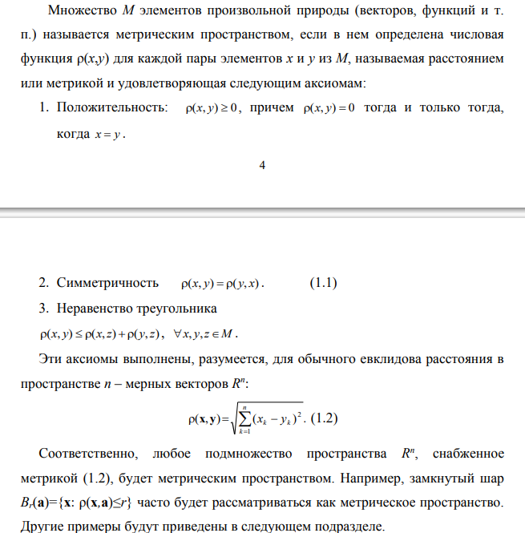
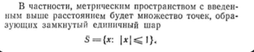
#### 8
Напишите ==формулу==, по которой определяют расстояние между числами x и y в пространстве R вещественных чисел, и ==докажите выполнение аксиом== метрического пространства.

формула: 
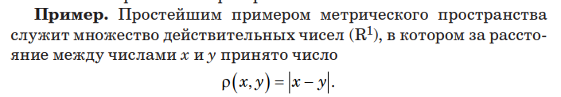
аксиомы и их доказательство:
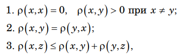
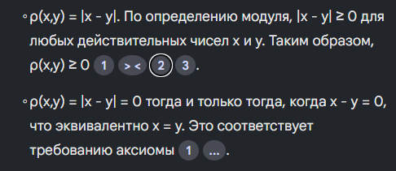
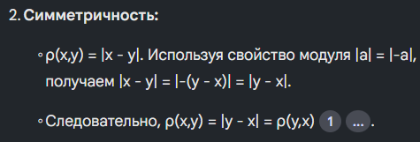
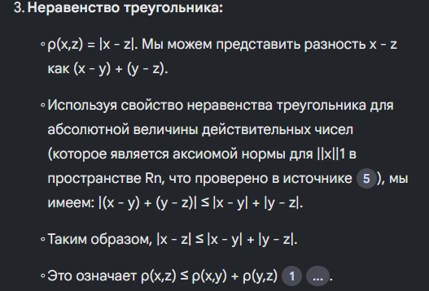
#### 9
Расскажите, по какой ==формуле== определяют расстояние между векторами ⃗x и ⃗y в n-мерном векторном пространстве Rn и ==докажите выполнение аксиом== метрического пространства
Формула:
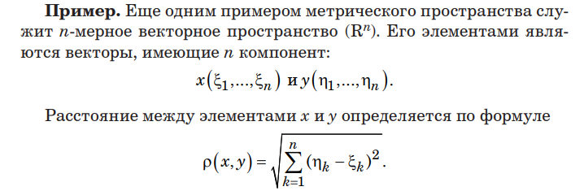
док-во:
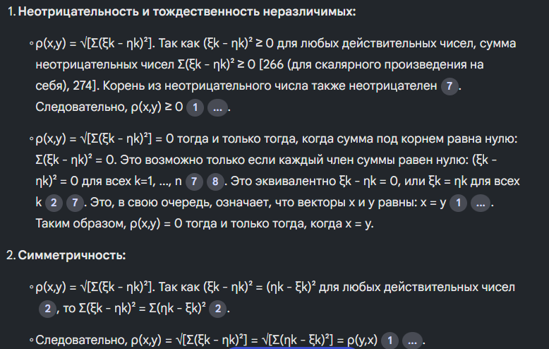
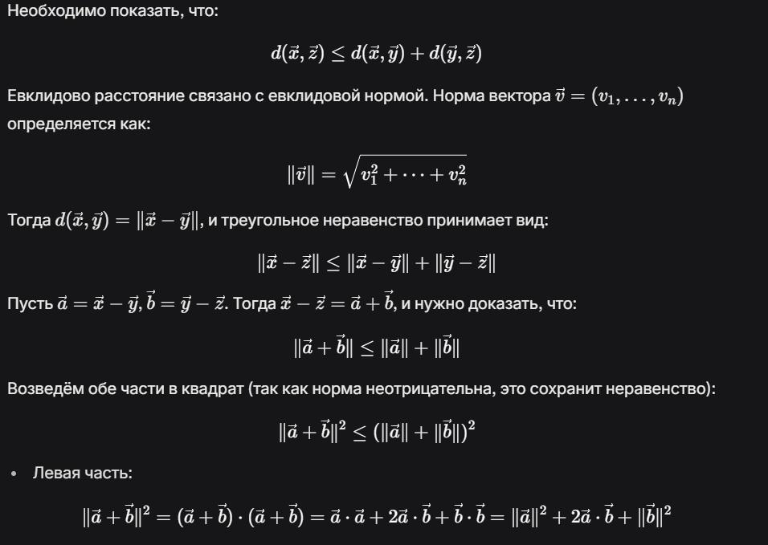
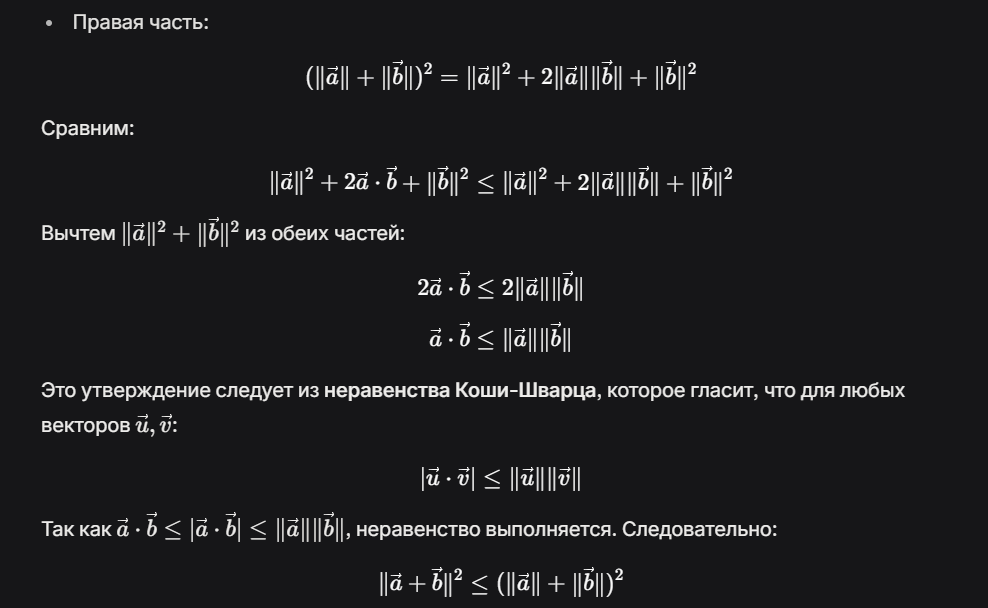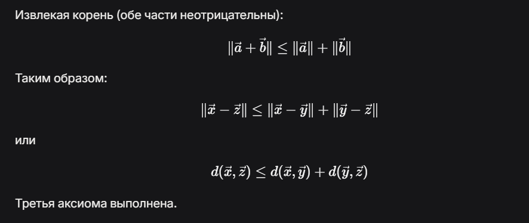
#### 10
Напишите ==формулу==, исходя из которой на множестве C([a; b]) непрерывных функций аргумента t ∈ [a; b] вводят чебышевскую метрику, и докажите выполнение аксиом метрического пространства для этой метрики.
формула:
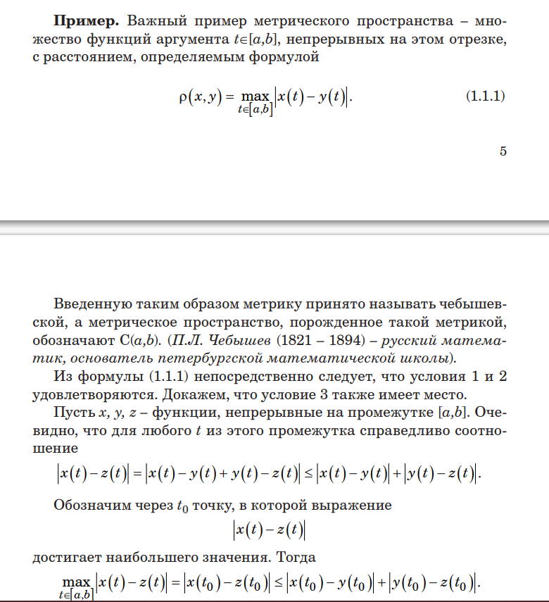
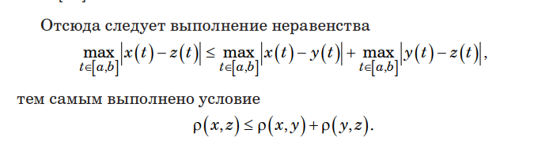

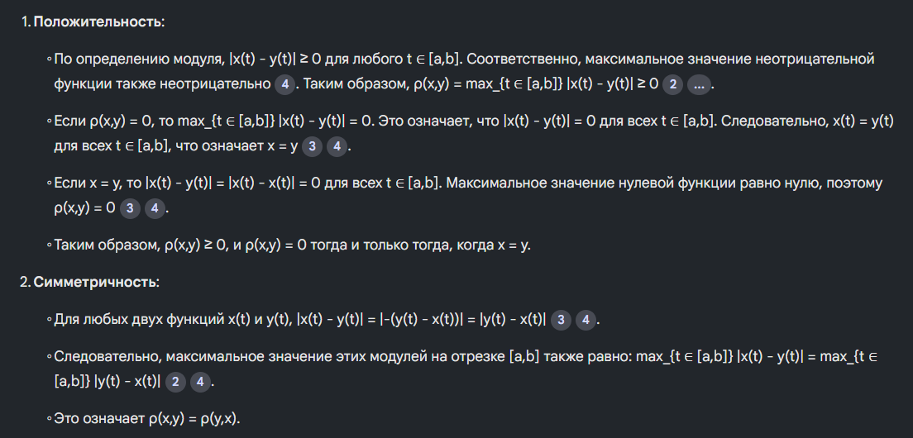

#### 11
Расскажите, ==как определяется== среднеквадратическая метрика на множестве непрерывных функций на отрезке [a; b]
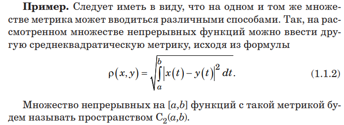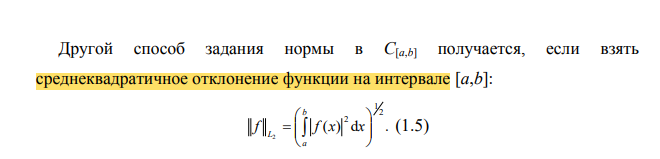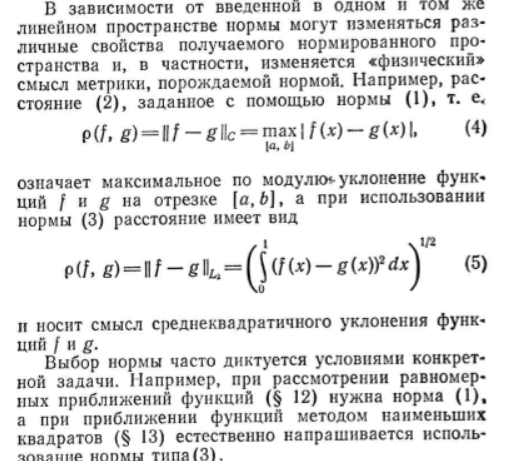
### 12-15

### 16-20