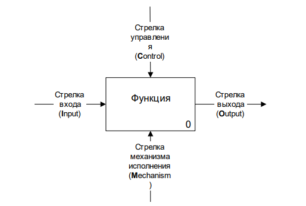
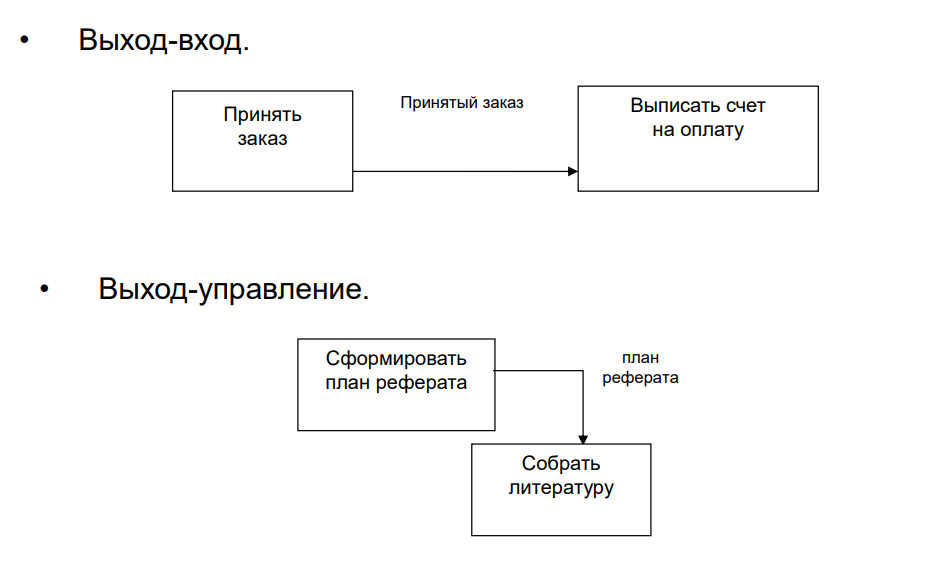
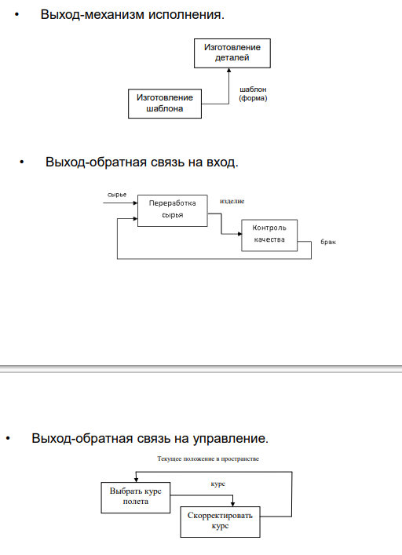
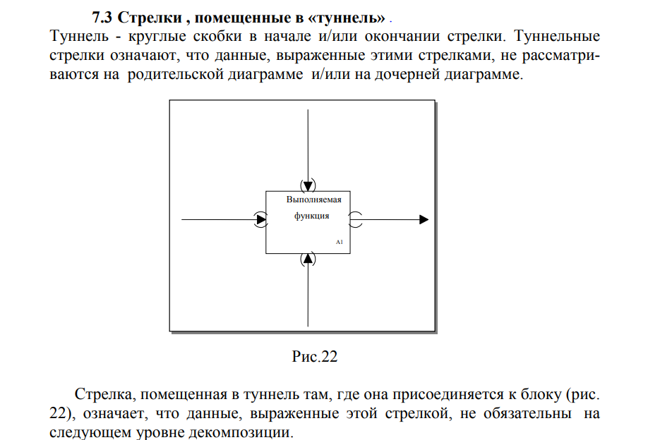
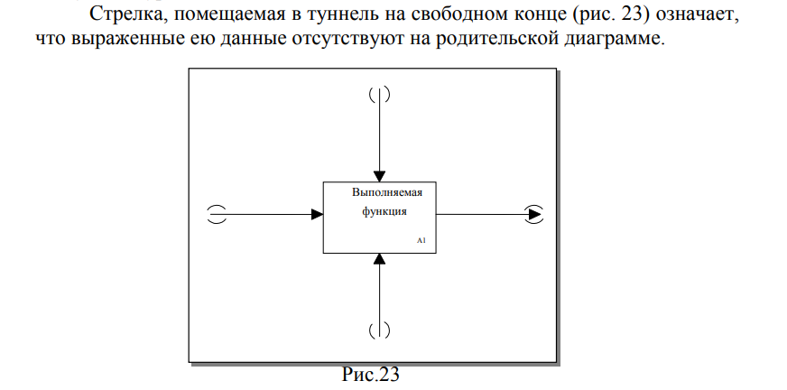
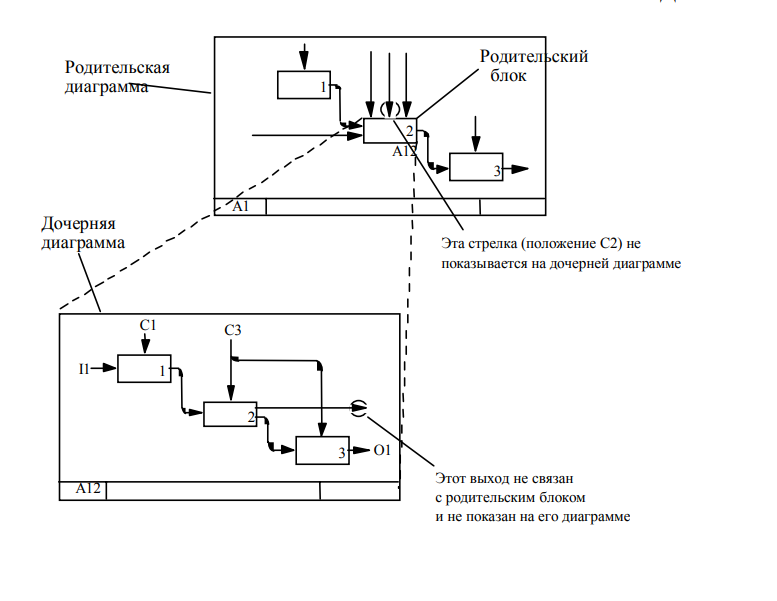

# 6 Билет

Метод IDEF0. Нотация IDEF0. Правила соединения блоков. Туннелирование. Порядок построения модели IDEF0

## Метод
метод создания функциональной модели, отображающей структуру и функции системы, а также потоки информации и материальных объектов, связывающие эти функции
	(язык описания бизнес-процессов)
		соподчиненность объектов. В IDEF0 рассматриваются логические отношения между работами, а не их временна́я последовательность (поток работ).
			описания системы в целом как множества взаимозависимых функций (действий). Функции системы исследуются независимо от объектов, обеспечивающих их выполнения. Такая сугубо «функциональная» точка зрения позволяет четко отделить аспекты назначения системы от вопросов ее реализации. IDEF0 часто используется как способ исследования и проектирования систем на логическом уровне. Результаты анализа с помощью IDEF0 могут применяться при проектировании с использованием DFD.
## Нотация
IDEF0 определяет два графических объекта:
1. Блок, с помощью которого обозначается некоторая функция (действие).
2. Стрелка, с помощью которой указываются информационные или материальные объекты.

Наименование функции (обязательно должно быть) должно характеризовать процесс и состоять из глагола или отглагольного существительного с дополнением. Наименование должно соответствовать выбранной точки зрения моделирования. Для функционального блока обязательно должно быть указано наименование.

1. Вход (Input, I).
	необязательно
		информация или сырьё, потребляемое или преобразуемое функциональным блоком для производства выхода
2. Управление, или контроль (Control, C).
	обязательно
		стандарты, правила, инструкции
		определяют чем регулируется выполнение функции 
3. Выход (Output, O).
	обязательно
		информация или продукт, которые получаются по завершению функционального блока
			Важно, чтобы наименования входных и выходных стрелок различались
4. Исполняющий механизм
	необязательно
		персонал, оборудование
			с помощью чего и посредством которого выполняется моделируемое действие

Блоки идут сверху вниз, слева направо (первый в верхнем левом углу)

Контекстная диаграмма:

## Правила соединения блоков
Все блоки нумеруются. Номер имеет вид <префикс><цифра>. Префикс представляет совокупность некоторой строки (обычно символ “A”) и номера родительского блока. Для блоков первого уровня детализации номер родительского не указывается. Контекстная функция обозначается как A0, декомпозирующие ее блоки — A1, A2, A3,... Далее, блок A1 может декомпозироваться на A1.1, A1.2,...; A1.1 — на A1.1.1, A1.1.2,... Точки обычно не ставятся, поскольку на грамотно построенной диаграмме не бывает больше 6-7 блоков. Т.е.: A0, A1, A11, A111,...

Общие рекомендации по построению модели: 1. На каждом уровне представлять не более 3-6 функциональных блоков. 2. Не загромождать диаграмму несущественными на текущем уровне функциями и объектами. 3. Одновременно вести декомпозицию функций и объектов. 4. При определении связанных блоком стрелок сначала стараться описать стрелки выходов и управления, поскольку их наличие обязательно. Если не ясно, относить ли стрелку к входу или управлению, то следует выбирать последнее. Следует помнить, что управление можно рассматривать как особый вид входа. 5. Следует выбирать ясные и полные наименования элементов.

все стрелки, связанные с рассматриваемым функциональным блоком, должны присутствовать на декомпозирующей его диаграмме (если таковая имеется). Исключения из этого правила взаимоувязанные стрелок возможно только в случае использования механизма туннелирования.
## Туннелирование

## Порядок построения модели
1. Определение цели моделирования.
2. Определение точки зрения (непосредственный исполнитель процесса, управленец, внешний аналитик и т.п.).
Модель должна разрабатываться исходя из единственной и заранее определенной точки зрения. Это обеспечивает внутреннюю целостность и в значительной степени предотвращает постоянное изменение структуры.
Определение цели моделирования и точки зрения позволяют выявить границы моделирования: ширину и глубину охвата. Часто строится целый набор моделей для разных точек зрения.